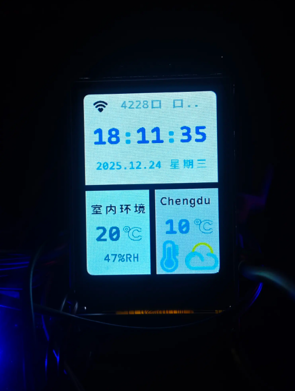
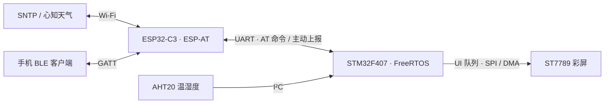

# STM32F4 FreeRTOS 天气时钟 · BLE 扩展

基于 [yuxingcao6/WeatherClock](https://github.com/yuxingcao6/WeatherClock) 的天气时钟项目。本版本在原有的联网校时、天气展示和温湿度采集功能上，新增 ESP32-C3 ESP-AT BLE GATT 通信，让手机等 BLE 客户端可以读取环境数据、接收更新通知，并调整室内采样周期。

**硬件组合：** STM32F407、ESP32-C3（ESP-AT 固件）、ST7789 彩屏、AHT20 温湿度传感器。修改版于 2026-09-19 整理，按仓库中的 [GPL-3.0 许可证](LICENSE)发布；原项目和第三方组件的版权声明予以保留。

  

界面照片：时间、日期、室内温湿度与室外天气。画面中的城市和读数仅为拍摄时的运行示例。

## 功能总览

| 模块 | 实现内容 |
| --- | --- |
| 时间与日期 | ESP32-C3 获取 SNTP 时间，STM32 校准片上 RTC；屏幕持续刷新时间与日期。校时成功后按小时同步，失败时缩短重试间隔。 |
| 室外天气 | 经 ESP-AT 发起 HTTP 请求，解析心知天气的实时天气数据，在主界面展示温度和天气图标。 |
| 室内环境 | 通过 AHT20 采集温度与湿度，同步更新屏幕和 BLE GATT 环境特征值。 |
| 彩屏界面 | ST7789 显示时间、日期、Wi-Fi 状态、室内温湿度和室外天气；UI 消息集中交由独立任务绘制。 |
| BLE 通信 | ESP32-C3 作为 GATT Server 广播 `WeatherClock`；客户端可读取环境值、订阅 Notify，并写入采样周期。 |
| 异常处理 | BLE 初始化失败不阻断天气时钟主体；BLE 断连后重新启动广播。 |

## 系统架构

应用层由 FreeRTOS 软件定时器调度校时、网络状态、室内采集和室外天气更新。周期性网络请求及 BLE 通知等 AT 操作交由工作队列处理；UI 绘制由独立任务消费消息，减少不同业务直接操作屏幕带来的冲突。ESP-AT 接收路径将 BLE 连接、断连和写入事件快速投递到 BLE 队列，再由任务解析和处理。

### 关键设计

| 设计点 | 代码中的实现 |
| --- | --- |
| 中断与业务分离 | ESP-AT 接收路径只复制 BLE 主动上报事件并入队；事件解析、状态更新和后续 AT 操作由任务完成。 |
| 显示操作集中管理 | 页面向 UI 队列提交绘制消息，独立 UI 任务统一驱动 ST7789，避免多个业务任务同时绘制。 |
| 采集与 BLE 解耦 | AHT20 更新使用非阻塞方式提交环境数据；队列满时允许丢弃中间样本，不让 BLE 拥塞拖住采集流程。 |
| 运行状态处理 | SNTP 校时失败后缩短重试周期；BLE 初始化失败不阻断基础时钟；BLE 断连后重新启动广播。 |

| 周期任务 | 默认间隔 | 说明 |
| --- | --- | --- |
| RTC 显示刷新 | 1 秒 | 更新屏幕时间与日期 |
| Wi-Fi 状态检查 | 5 秒 | 更新连接状态与 SSID 显示 |
| 室内温湿度采集 | 3 秒 | 可通过 BLE 临时调整为 1～60 秒 |
| 室外天气更新 | 1 分钟 | 请求实时天气并更新温度、图标 |
| SNTP 校时 | 成功后 1 小时 | 失败时约 1 秒后重试 |

## BLE GATT 接口

| UUID | 特征 | 操作 | 数据格式 |
| --- | --- | --- | --- |
| `0xFFF0` | 天气服务 | — | 包含下列两个特征 |
| `0xFFF1` | 室内环境 | Read、Notify | 4 字节小端序：有符号 `int16` 温度 ×100，无符号 `uint16` 湿度 ×100 |
| `0xFFF2` | 采样周期 | Read、Write | ASCII 十进制秒数，范围 `1`～`60` |

例如 `25.34°C`、`61.20%` 编码为 `E6 09 E8 17`。收到新测量值时，固件更新可读特征；有客户端连接时额外发送 Notify。写入采样周期后，应用层动态调整 AHT20 采集定时器；该设置仅在本次运行期间有效。BLE 发布采用非阻塞入队，队列拥塞时可能跳过中间样本，以免拖慢传感器更新流程。

可使用 nRF Connect 等通用 BLE 客户端验证。ESP32-C3 需先配置本项目的 GATT 表，具体服务索引、特征索引、广播设置和烧录步骤见 [BLE 实现说明](app/ble/README.md)。

## 本版本的改动

- `app/ble/`：新增 BLE 任务、GATT 数据编码、ESP-AT 命令封装与主动上报事件解析。
- `app/app.c`、`app/main.c`：将传感器数据发布到 BLE，接入 BLE 初始化与采样周期调整。
- `driver/esp_at/`：扩展 BLE 主动上报事件的分发逻辑。
- `app/tests/test_ble_protocol.c`：提供环境数据编码、采样周期边界与 AT 命令构造的主机端测试源码。

## 编译与配置

1. 将 `app/local_config.example.h` 复制为 `app/local_config.h`，填入自己的 Wi-Fi 信息、心知天气 API 密钥与天气查询位置。该本地配置文件已加入 `.gitignore`。
2. 使用 Keil µVision 打开 `mdk/stm32f407.uvprojx`，编译并烧录 STM32 工程。
3. 按 [BLE 实现说明](app/ble/README.md) 准备 ESP32-C3 的 ESP-AT GATT 表。仅烧录默认 ESP-AT 固件不足以提供本项目使用的 GATT 特征。

**验证边界：** 上方照片展示天气时钟界面，尚未提供 BLE 客户端的实测截图或日志。本次文档整理没有重新进行 STM32 编译和 BLE 实机联调。主界面的城市文字目前固定在 `app/page/main_page.c`，更换天气查询位置时需要同步修改该文字。

## 来源与许可

- 原项目：[yuxingcao6/WeatherClock](https://github.com/yuxingcao6/WeatherClock)。本仓库说明的 BLE 模块是在原项目基础上新增的内容。
- 许可证：[GPL-3.0](LICENSE)。再发布时请遵守许可证，并保留源码中原作者和第三方组件的版权声明。
